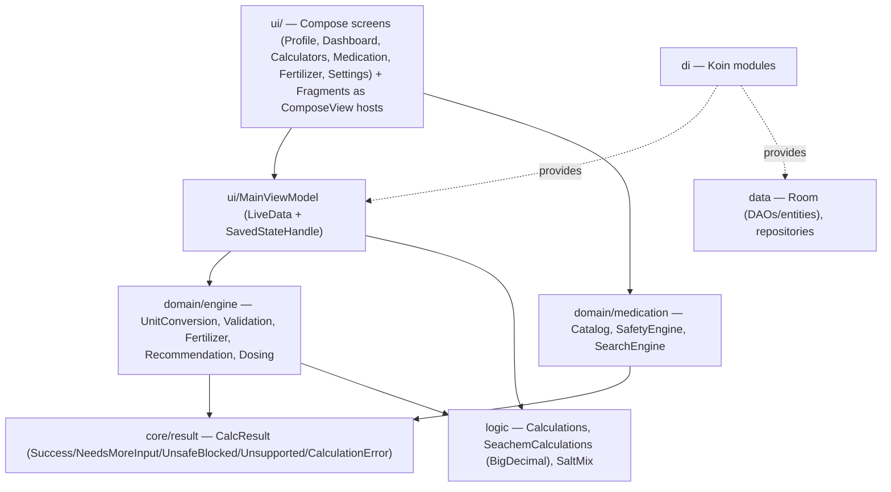
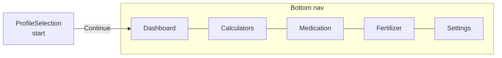
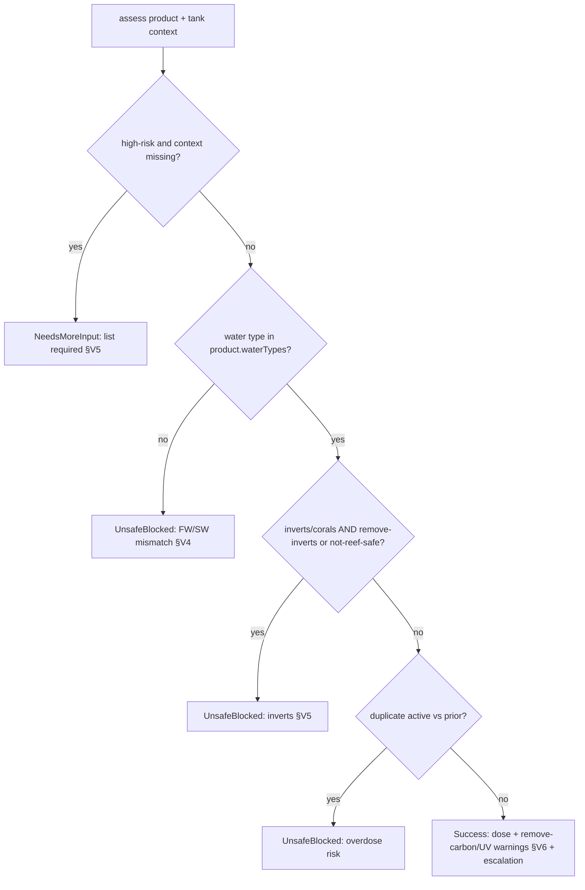
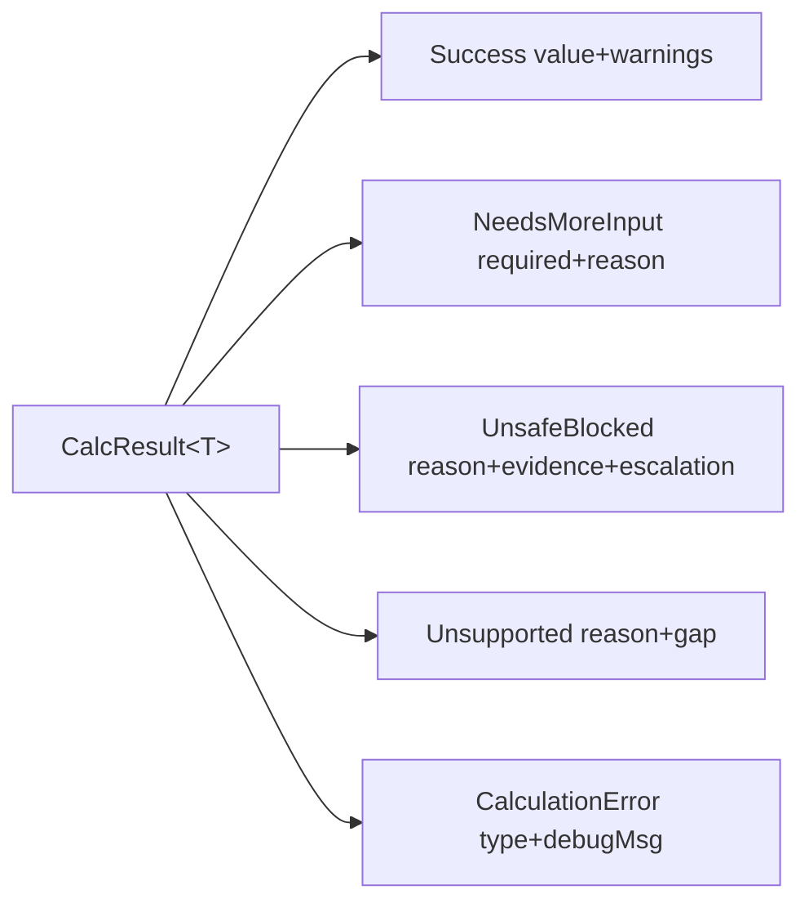

# DIAGRAMS — Seachem-Dosing v2.0 (Mermaid source)

## Architecture (layers)

```mermaid
flowchart TD
  UI["ui/ — Compose screens (Profile, Dashboard, Calculators, Medication, Fertilizer, Settings) + Fragments as ComposeView hosts"]
  VM["ui/MainViewModel (LiveData + SavedStateHandle)"]
  ENG["domain/engine — UnitConversion, Validation, Fertilizer, Recommendation, Dosing"]
  MED["domain/medication — Catalog, SafetyEngine, SearchEngine"]
  CORE["core/result — CalcResult<T> (Success/NeedsMoreInput/UnsafeBlocked/Unsupported/CalculationError)"]
  LOG["logic — Calculations, SeachemCalculations (BigDecimal), SaltMix"]
  DATA["data — Room (DAOs/entities), repositories"]
  DI["di — Koin modules"]
  UI --> VM --> ENG
  UI --> MED
  ENG --> CORE
  MED --> CORE
  ENG --> LOG
  VM --> LOG
  DI -. provides .-> VM
  DI -. provides .-> DATA
```

## Navigation (bottom nav)

```mermaid
flowchart LR
  P[ProfileSelection<br/>start] -->|Continue| D[Dashboard]
  subgraph Bottom nav
    D --- C[Calculators] --- M[Medication] --- F[Fertilizer] --- S[Settings]
  end
```

## Medication safety gate (§V4–V6)

```mermaid
flowchart TD
  A[assess product + tank context] --> B{high-risk and context missing?}
  B -- yes --> NMI[NeedsMoreInput: list required §V5]
  B -- no --> C{water type in product.waterTypes?}
  C -- no --> UB1[UnsafeBlocked: FW/SW mismatch §V4]
  C -- yes --> E{inverts/corals AND remove-inverts or not-reef-safe?}
  E -- yes --> UB2[UnsafeBlocked: inverts §V5]
  E -- no --> G{duplicate active vs prior?}
  G -- yes --> UB3[UnsafeBlocked: overdose risk]
  G -- no --> OK[Success: dose + remove-carbon/UV warnings §V6 + escalation]
```

## Calculation result model (§V1)

```mermaid
flowchart LR
  CR["CalcResult&lt;T&gt;"] --> S[Success value+warnings]
  CR --> N[NeedsMoreInput required+reason]
  CR --> UB[UnsafeBlocked reason+evidence+escalation]
  CR --> U[Unsupported reason+gap]
  CR --> CE[CalculationError type+debugMsg]
```
