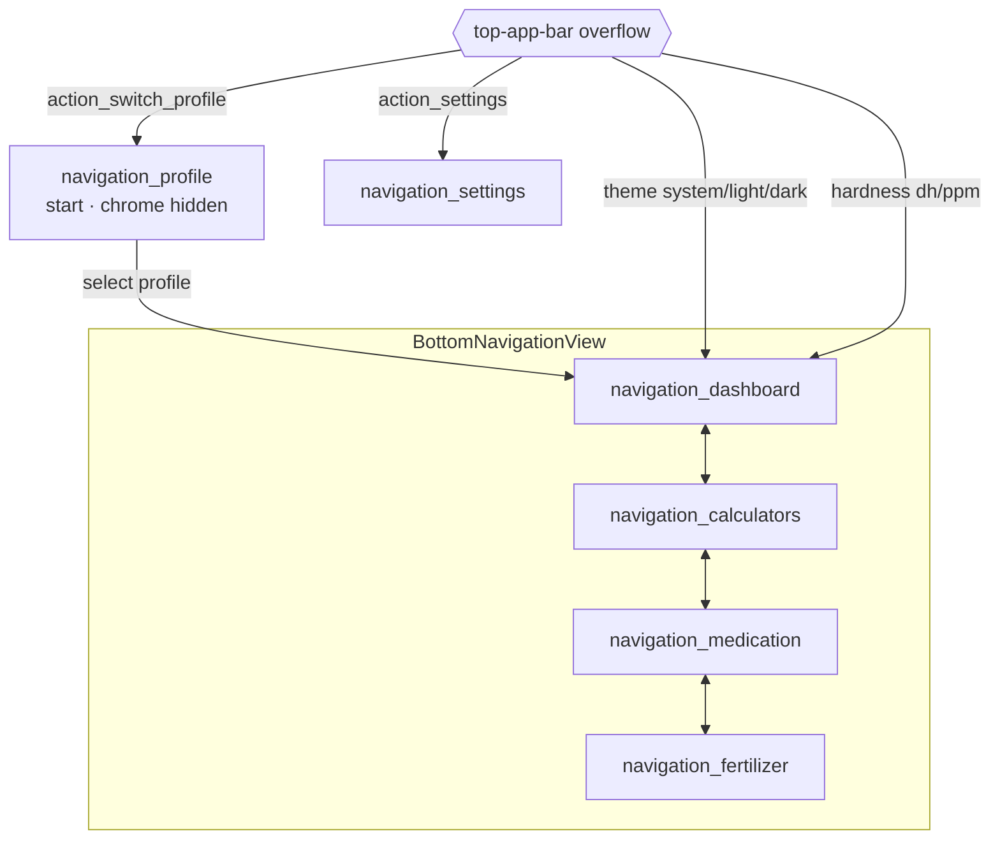

# Navigation & Flow Map — v2.0-wip

Grounded in `MainActivity.kt`, `res/navigation/mobile_navigation.xml`, `res/menu/bottom_nav_menu.xml`. No code changed.

## Mechanism
- **Fragment-based** Jetpack Navigation (`navigation-fragment-ktx` / `navigation-ui-ktx`), XML graph, `BottomNavigationView.setupWithNavController` (`MainActivity.kt:53`).
- Start destination: `navigation_profile`.
- `navigation-compose` dependency present but **unused** — either adopt it (shell→Compose) or drop it. See remediation R-1.
- Top app bar title is driven by destination `label`; two labels are hardcoded English in the graph (`Medication`, `Fertilizer` at `mobile_navigation.xml:26,31`) instead of `@string/...` → localization gap (ISSUE-A11Y-004).

## Destination graph

Notes:
- Bottom nav exposes dashboard / calculators / medication / fertilizer (`bottom_nav_menu.xml`). **Settings** and **Profile** are reached only via the top-app-bar overflow menu (`MainActivity.kt:70-112`), not the bottom bar.
- Profile + Settings are not bottom-nav tabs → discoverability cost for Settings (ISSUE-NAV-001, low).
- No deep links, no nested graphs, no args between destinations — all state is shared through `MainViewModel` (`activityViewModels`).

## Key user flows (as implemented)

### Flow A — Beginner medication (`MedicationScreen.kt:159-197`)
1. Pick water type (dropdown) → 2. Toggle inverts/corals → 3. Select symptom chips (multi) → 4. "Show compatible options" → 5. Search field filters `MedicationSearchEngine.search(query, waterType)` → 6. Each result run through `MedicationSafetyEngine.assess(...)` with `volumeLitres = 1` placeholder → 7. Rows tagged Compatible / Blocked / Needs-expert. Disclaimer shown twice (top + pre-results). **By design never diagnoses from symptoms.**

### Flow B — Expert medication (`MedicationScreen.kt:91-130`)
Water type → product (filtered by water type) → volume (L) → 3 switches (inverts, filtration ack, species confirmed) → "Assess safety" → `MedicationSafetyEngine.assess` → `AdviceCard` renders the `CalcResult` sealed states (Success / NeedsMoreInput / UnsafeBlocked / Unsupported / CalculationError).

### Flow C — Dosing (Dashboard/Calculators)
Profile → parameters/volume entered (persisted via `SavedStateHandle`) → `MainViewModel.calculateUniversal(product, current, target, scale)` dispatches a 26-arm `when` over `SeachemCalculations` (`MainViewModel.kt:185-260`) → result rendered in Compose.

## Flow risks
- Beginner flow's `volumeLitres = BigDecimal("1")` placeholder (`MedicationScreen.kt:192`) means any dose math in beginner mode is non-physical by construction — acceptable only because beginner mode shows compatibility, not doses; verify the engine never emits a numeric dose in this path (test T-MED-1).
- Flows B/C interaction state is volatile (`remember`, not `rememberSaveable`) → rotation/process death resets the whole flow (ISSUE-STATE-001).
